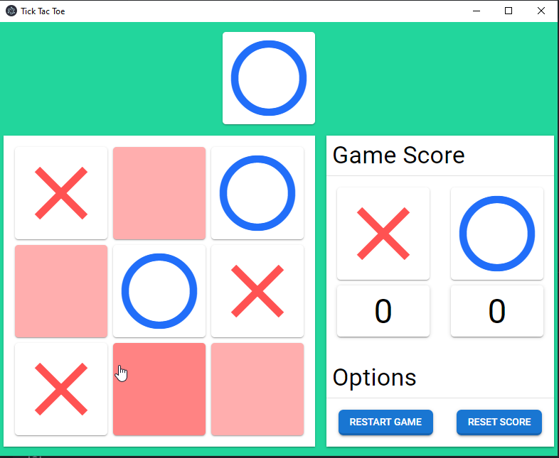

This is a Tic Tac Toe desktop app created with vue3 and electron.

## Installation

Clone this repo and run

```
npm install
```

## Start the app in dev mode

```
npm run electron:dev
```

## Build the app (for windows)

```
npm run app:build
```

If you want to apply you own config or build for another OS feel free to customize the `electron-builder-config.js` file.

## App screen



